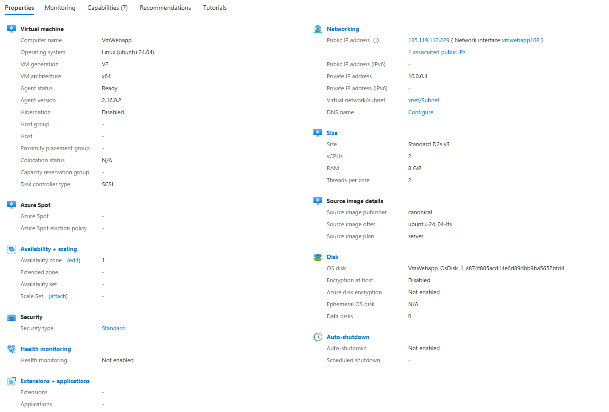
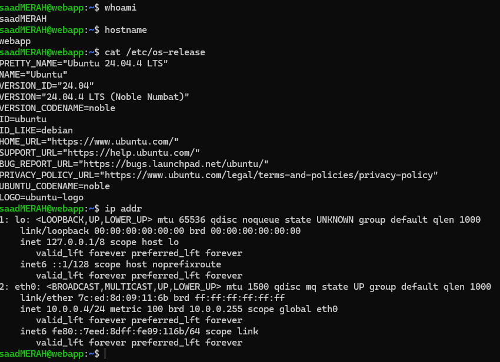
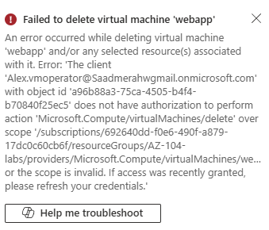
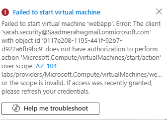
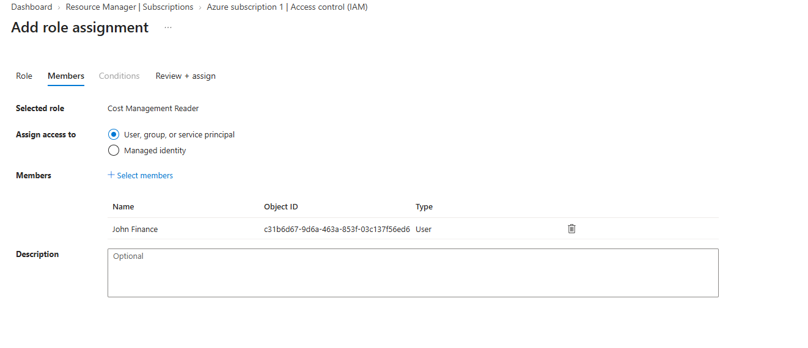

# Azure Secure VM & RBAC Lab

## Overview

This project demonstrates how to deploy and secure an Ubuntu virtual machine in Microsoft Azure using:

- Azure Virtual Machines
- Virtual Network and Subnet
- SSH
- Microsoft Entra ID
- Azure RBAC
- Custom Roles
- Principle of Least Privilege
- Cost Management permissions

---

## Architecture

```text
Azure Subscription
│
├── John Finance
│   └── Cost Management Reader
│
└── Resource Group: AZ-104-labs
    │
    ├── VmWebapp
    │   └── Ubuntu 24.04 LTS
    │
    ├── Alex Martin
    │   └── Custom VMoperator Role
    │
    └── Sarah Lee
        └── Reader
```

---

## Azure VM

The lab uses an Ubuntu Server 24.04 LTS virtual machine.

Main configuration:

```text
VM Name: VmWebapp
OS: Ubuntu 24.04 LTS
vCPU: 2
RAM: 8 GiB
Private IP: 10.0.0.4
```



---

## Linux Verification

After deployment, I connected to the VM using SSH and verified the system.

```bash
whoami
hostname
cat /etc/os-release
ip addr
```



---

## Microsoft Entra ID Users

Three users were created to simulate different company roles:

| User | Role |
|---|---|
| Alex Martin | VM Operator |
| Sarah Lee | Security / Reader |
| John Finance | Cost Analyst |


---

## Custom RBAC Role

A custom role called `VMoperator` was created for Alex.

Permissions include:

```text
Microsoft.Compute/virtualMachines/read
Microsoft.Compute/virtualMachines/start/action
Microsoft.Compute/virtualMachines/restart/action
Microsoft.Compute/virtualMachines/deallocate/action
```

Alex is not allowed to delete the VM.


---

## Permission Testing

### Alex Martin

Alex can manage the VM but cannot delete it.

```text
View VM       ✅
Start VM      ✅
Restart VM    ✅
Stop VM       ✅
Delete VM     ❌
```



### Sarah Lee

Sarah has read-only access and cannot start the VM.

```text
View Resources    ✅
Start VM          ❌
Modify VM         ❌
Delete VM         ❌
```



### John Finance

John was assigned:

```text
Cost Management Reader
```

at subscription scope.



---

## Security Concepts

This lab demonstrates:

- Principle of Least Privilege
- Azure RBAC
- Custom Roles
- Resource access control
- Microsoft Entra ID
- Secure cloud administration
- Permission testing

---

## Next Steps

- [x] Deploy Azure VM
- [x] Configure networking
- [x] Connect using SSH
- [x] Create Entra ID users
- [x] Configure RBAC
- [x] Test permissions
- [ ] Azure Policy
- [ ] Resource tagging
- [ ] Disk encryption
- [ ] Budget and cost alerts

---

## Author

**Saad MERAH**

IT & Cybersecurity professional focused on:

- Microsoft Azure
- Networking
- Systems Administration
- Cybersecurity
- Cloud Security
